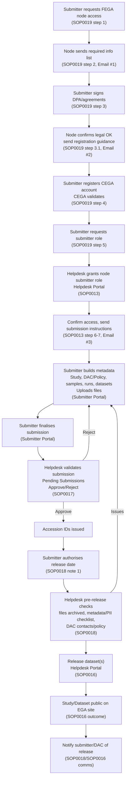

# FEGA SOP Index

Curated list of SOP templates, node-specific instances, and a visual walk-through of the submitter-to-publication flow.

### Quick navigation
- Process flow: request to public release
- SOP templates
- Node instances
- Authoring a new SOP

## Process flow: SOP0019 request through public release
Submitter request (SOP0019) → role granting (SOP0013) → submission validation (SOP0017) → pre-release checks (SOP0018) → dataset publication (SOP0016).

## SOP templates

| Name | Identifier | Template version | Topic | SOP type | Node | Steps | Last updated |
| --- | --- | ---: | --- | --- | --- | ---: | --- |
| Changing User Institution | [FEGA-SOP0002](sop/templates/FEGA-SOP0002_EXAMPLE_SOP_for_Changing_User_Institution.md) | — | User-facing Processes | SOP | — | 4 | — |
| EGA Helpdesk Ticket Assignment | [FEGA-SOP0003](sop/templates/FEGA-SOP0003_EXAMPLE_SOP_for_EGA_Helpdesk_Ticket_Assignment.md) | — | Internal Node Processes | SOP | — | 5 | — |
| EGA Helpdesk Ticket Management | [FEGA-SOP0004](sop/templates/FEGA-SOP0004_EXAMPLE_SOP_for_EGA_Helpdesk_Ticket_Management.md) | — | Internal Node Processes | SOP | — | 9 | — |
| Change Submission Data/Metadata | [FEGA-SOP0005](sop/templates/FEGA-SOP0005_EXAMPLE_SOP_for_Handling_Dataset_Release.md) | — | User-facing Processes | SOP | — | — | DD-MM-YYYY |
| Handling Incomplete Submissions | [FEGA-SOP0006](sop/templates/FEGA-SOP0006_EXAMPLE_SOP_for_Handling_Incomplete_Submissions.md) | — | User-facing Processes | SOP | — | 4 | — |
| Handling Unresponsive DACs | [FEGA-SOP0007](sop/templates/FEGA-SOP0007_EXAMPLE_SOP_for_Handling_Unresponsive_DACs.md) | — | User-facing Processes | SOP | — | 7 | — |
| Reporting Unreasonable Users | [FEGA-SOP0009](sop/templates/FEGA-SOP0009_EXAMPLE_SOP_for_Reporting_Unreasonable_Users.md) | — | User-facing Processes | SOP | — | 4 | — |
| Users Sharing Credentials | [FEGA-SOP0010](sop/templates/FEGA-SOP0010_EXAMPLE_SOP_for_Users_Sharing_Credentials.md) | — | User-facing Processes | SOP | — | — | — |
| Add new Helpdesk officers to your Helpdesk Portal | [FEGA-SOP0012](sop/templates/FEGA-SOP0012_SOP_for_Federated_EGA_Helpdesk_-_Add_new_Helpdesk_officers_to_your_Helpdesk_Portal.md) | v1.0 | SOP for Federated EGA Helpdesk | SOP | CEGA | 5 | 31-05-2023 |
| Grant submitter role to FEGA user using the Helpdesk Portal | [FEGA-SOP0013](sop/templates/FEGA-SOP0013_SOP_for_Federated_EGA_Helpdesk_-_Grant_submitter_role_to_FEGA_user_using_the_Helpdesk_Portal.md) | v1.2 | SOP for Federated EGA Helpdesk | SOP | CEGA | 6 | 14-10-2025 |
| How to obtain Helpdesk role for the first time | [FEGA-SOP0014](sop/templates/FEGA-SOP0014_SOP_for_Federated_EGA_Helpdesk_-_How_to_obtain_Helpdesk_role_for_the_first_time.md) | v1.0 | SOP for Federated EGA Helpdesk | SOP | CEGA | 6 | 31-05-2023 |
| Impersonate a FEGA user | [FEGA-SOP0015](sop/templates/FEGA-SOP0015_SOP_for_Federated_EGA_Helpdesk_-_Impersonate_a_FEGA_user.md) | v1.1 | SOP for Federated EGA Helpdesk | SOP | CEGA | 8 | 14-10-2025 |
| Release a FEGA dataset | [FEGA-SOP0016](sop/templates/FEGA-SOP0016_SOP_for_Federated_EGA_Helpdesk_-_Release_a_FEGA_dataset.md) | v1.1 | SOP for Federated EGA Helpdesk | SOP | CEGA | 14 | 14-10-2025 |
| Validate a submission | [FEGA-SOP0017](sop/templates/FEGA-SOP0017_SOP_for_Federated_EGA_Helpdesk_-_Validate_a_submission.md) | v1.1 | SOP for Federated EGA Helpdesk | SOP | CEGA | 14 | 14-10-2025 |
| Federated EGA Metadata Check and Release Protocol | [FEGA-SOP0018](sop/templates/FEGA-SOP0018_SOP_for_Federated_EGA_Metadata_Check_and_Release_Protocol_-_v2.0.md) | v2.2 | Joint CEGA/FEGA Node Processes | SOP | Joint | — | 21-11-2025 |
| FEGA Request from submitter to submit to FEGA node | [FEGA-SOP0019](sop/templates/FEGA-SOP0019_SOP_for_Federated_EGA_Request_from_submitter_to_submit_to_FEGA_node_-_v2.0.md) | v1.2 | SOP for Federated EGA Helpdesk | SOP | CEGA | 7 | 14-10-2025 |
| Withdraw Dataset | [FEGA-SOP0020](sop/templates/FEGA-SOP0020_SOP_for_withdrawing_FEGA_studies_datasets_from_the_EGA_website.md) | — | Joint CEGA/FEGA Node Processes | SOP | Joint | — | — |

## Node instances

| Name | Identifier | Template version | Topic | SOP type | Node | Instance version | Steps | Last updated |
| --- | --- | ---: | --- | --- | --- | ---: | ---: | --- |
| Add new Helpdesk officers to your Helpdesk Portal (FEGA Portugal) | [FEGA-PT-SOP0012](sop/instances/FEGA-PT-SOP0012_Add_new_Helpdesk_officers_to_your_Helpdesk_Portal.md) | v1.1 | SOP for Federated EGA Helpdesk | SOP | FEGA-PT | v1.0 | 5 | 14-10-2025 |
| Grant submitter role to FEGA user using the Helpdesk Portal (FEGA Portugal) | [FEGA-PT-SOP0013](sop/instances/FEGA-PT-SOP0013_Grant_submitter_role_to_FEGA_user_using_the_Helpdesk_Portal.md) | v1.1 | SOP for Federated EGA Helpdesk | SOP | FEGA-PT | v1.1 | 6 | 14-10-2025 |
| How to obtain Helpdesk role for the first time (FEGA Portugal) | [FEGA-PT-SOP0014](sop/instances/FEGA-PT-SOP0014_How_to_obtain_Helpdesk_role_for_the_first_time.md) | v1.1 | SOP for Federated EGA Helpdesk | SOP | FEGA-PT | v1.0 | 6 | 14-10-2025 |
| Impersonate a FEGA user (FEGA Portugal) | [FEGA-PT-SOP0015](sop/instances/FEGA-PT-SOP0015_Impersonate_a_FEGA_user.md) | v1.1 | SOP for Federated EGA Helpdesk | SOP | FEGA-PT | v1.0 | 8 | 14-10-2025 |
| Release a FEGA dataset (FEGA Portugal) | [FEGA-PT-SOP0016](sop/instances/FEGA-PT-SOP0016_Release_a_FEGA_dataset.md) | v1.1 | SOP for Federated EGA Helpdesk | SOP | FEGA-PT | v1.0 | 14 | 14-10-2025 |
| Validate a submission (FEGA Portugal) | [FEGA-PT-SOP0017](sop/instances/FEGA-PT-SOP0017_Validate_a_submission.md) | v1.1 | SOP for Federated EGA Helpdesk | SOP | FEGA-PT | v1.0 | 14 | 14-10-2025 |
| FEGA Request from submitter to submit to FEGA Portugal | [FEGA-PT-SOP0019](sop/instances/FEGA-PT-SOP0019_Request_from_submitter_to_submit_to_FEGA_Portugal.md) | v1.1 | SOP for Federated EGA Helpdesk | SOP | FEGA-PT | v1.2 | 7 | 14-10-2025 |

## Authoring a new SOP
Start from `sop/templates/FEGA-SOP0021_TEMPLATE_Federated_EGA_SOP_-_v1.1.md`.

- Copy the template and update metadata (Template ID, Template version, Topic, SOP type, Node, Instance version).
- Fill in Document Overview and Document History with owner, authors, dates, and key changes.
- Replace placeholders for purpose, scope, background, diagrams, procedures, and references with node-specific content.
