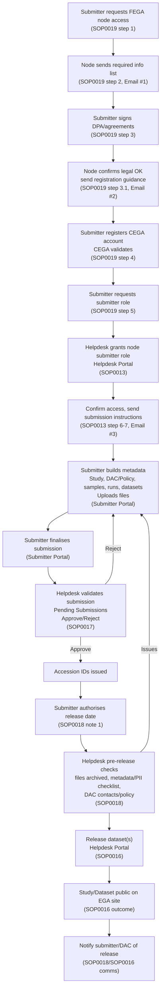

# Process flow: SOP0019 request through public release

Submitter request (SOP0019) → role granting (SOP0013) → submission validation (SOP0017) → pre-release checks (SOP0018) → dataset publication (SOP0016).

