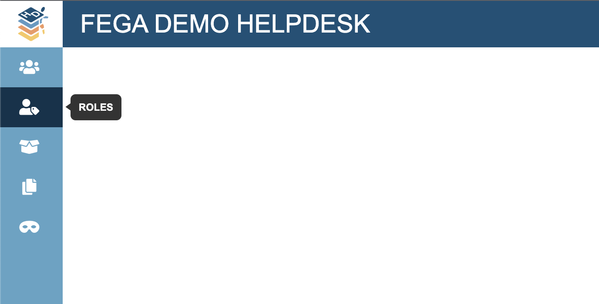
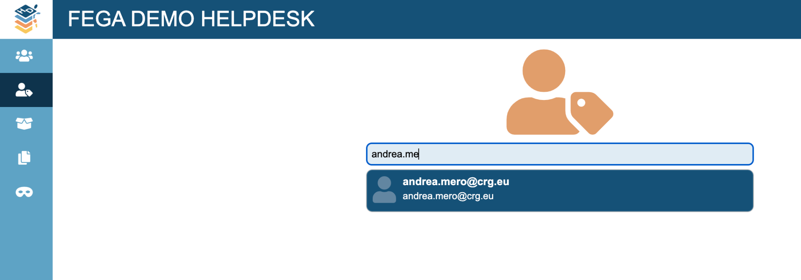
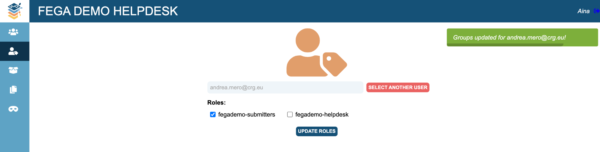
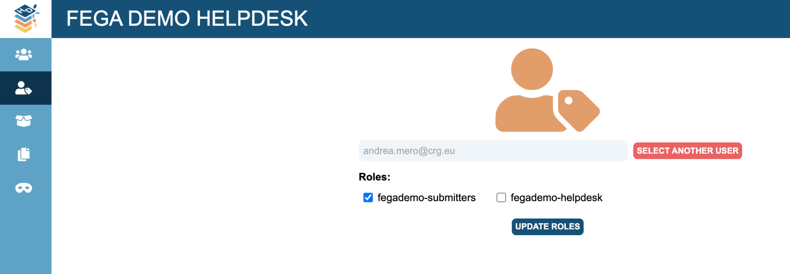

# FEGA SOP - SOP for Federated EGA Helpdesk - Grant submitter role to FEGA user using the Helpdesk Portal

| Metadata | Value |
| -- | -- |
| Template ID | `FEGA-PT-SOP0013` |
| Template version | `v1.1` |
| Topic | SOP for Federated EGA Helpdesk |
| SOP type | SOP |
| Node | FEGA-PT |
| Instance version | `v1.1` |

## Document History

| Template version | Instance version | Author(s) | Description of changes | Date |
| -- | -- | -- | -- | -- |
| `v1.1` | `v1.0` | Jorge Oliveira, Miguel Cisneiros, Jorge Silva | Initial release | 07-04-2025 |
| `v1.1` | `v1.1` | Jorge Silva - BioData.pt and UAVR | Link corrections and numbering alignment | 14-10-2025 |

## Purpose

Once you have set up your FEGA Helpdesk Portal, you can manage who
becomes a submitter to deposit data to your FEGA Portugal submitter
portal. If you don’t know how to get access to your FEGA Helpdesk node
for the first time, please follow
[<u>this</u>](./FEGA-SOP0012_SOP_for_Federated_EGA_Helpdesk_-_Add_new_Helpdesk_officers_to_your_Helpdesk_Portal.md)
SOP.

## Scope

This SOP indicates the steps to follow to grant a submitter role to a
FEGA user on the FEGA Portugal Submitter Portal.

## Procedure

1.  *The new member to be added to your FEGA Helpdesk Portal needs to
    register as an EGA user by populating the [<u>registration
    form</u>](https://ega-archive.org/register/).*

2.  *CEGA Helpdesk will have to verify your account. Once it has been
    verified by CEGA Helpdesk, proceed with step 3.*

3.  *A FEGA Helpdesk admin will login to their FEGA Helpdesk Portal
    (helpdesk.portugal.ega.archive.org) and go to ROLES*

4.  *Look for the member registered in step 1. Make sure you write the
    full username or email. The suggestion box is no longer
    implemented.*

5.  *Click on the role you want to grant to this user ({fega}
    submitters) and click on UPDATE ROLE*

6.  *Done!*

