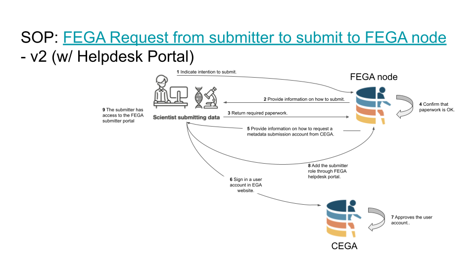

# FEGA SOP - SOP for Federated EGA Helpdesk - FEGA Request from submitter to submit to FEGA Portugal

| Metadata | Value |
| -- | -- |
| Template ID | `FEGA-PT-SOP0019` |
| Template version | `v1.1` |
| Topic | SOP for Federated EGA Helpdesk |
| SOP type | SOP |
| Node | FEGA-PT |
| Instance version | `v1.2` |

## Document History

| Template version | Instance version | Author(s) | Description of changes | Date |
| -- | -- | -- | -- | -- |
| `v1.1` | `v1.1` | Jorge Oliveira, Miguel Cisneiros, Jorge Silva | Initial release | 25-03-2025 |
| `v1.1` | `v1.2` | Jorge Silva - BioData.pt and UAVR | Fixed internal bookmarks and SOP link | 14-10-2025 |

### Purpose

Provide the full set of instructions and support to allow the user to
start the data and metadata upload process into the FEGA node.

### Scope

This SOP must be used to create a metadata-only submission account at
CEGA for data submission to the FEGA Portugal node upon the completion
of the FEGA nodes’ Data Processing Agreement (DPA) with the submitter.
This SOP details how to use the Helpdesk to open the submission account
for the submission of the metadata to CEGA.

### Procedure

1.  Submitter contacts the FEGA helpdesk requesting
    to submit to FEGA.

2.  Submitter obtains information from the FEGA
    Portugal node that is required for submission.

    1.  [Helpdesk template email to send to the
        user](#email-template-1---first-set-of-information-for-new-submitters)

3.  Submitter signs and returns the Data Processing
    Agreement (and any related agreements) to the FEGA node.

    1.  [Register in EGA -
        email](#email-template-2---register-in-ega) (ONLY after DPA
        approved)

4.  The Submitter creates an account on the CEGA
    website, which CEGA will validate as a standard procedure.

5.  After the user account is validated by the
    central EGA. The submitter contacts the FEGA Portugal helpdesk
    requesting to add a submitter role to their account.

6.  The FEGA Portugal helpdesk adds the submitter
    role to the user account by using the FEGA helpdesk portal. (SOP:
    [Adding submitter role using Helpdesk
    Portal](https://docs.google.com/document/d/1hGn4W6DNFNdfLB-x3Oz8gWurPSHkajP1/edit?usp=drive_link&ouid=108280939628938870978&rtpof=true&sd=true))

7.  After the submitter role has been added for the
    user, the user has access to the FEGA Portugal Submitter Portal and
    can start the submission.

    1.  [Confirmation email - sent to the user informing them that they
        can now log into the FEGA Submitter
        Portal.](#email-template-3---confirmation-of-submitter-access)

#### Complete workflow

### Email Template \#1 - First set of information for new submitters

**Subject:** Guidance for submission to FEGA Portugal

Dear [Recipient Name],

Thank you for reaching out to our Helpdesk. We are happy to assist you with the process of uploading data into FEGA Portugal. To get started, please provide the following details:

1. **Legal and ethical compliance**

   - Start by contacting your institution's Data Protection Officer (DPO).
   - Ensure you have the relevant ethics committee approval documents ready for submission.
   - Completing the Data Processing Agreement (DPA) with the FEGA Portugal node is required.
   - While the DPO handles the legal tasks, we can already advance the technical steps.

2. **Data information**

   - Confirm the file types you will submit (for example FASTQ, BAM or VCF).
   - Provide an estimate of your total data volume (in GB or TB).

3. **Technical capabilities**

   - Let us know if you or your team have experience using the terminal or command-line tools.
   - Indicate whether a bioinformatician or IT specialist is available to assist with the uploads.

4. **Metadata requirements**

   - Let us know which metadata templates or guidance you require.
   - This typically includes sample information, study details, file descriptions and methodologies.

If you have any questions or need clarification, please let us know and we will happily guide you through the process.

Warm regards,

[Your Name]  \
[Helpdesk Team]  \
[Contact Information]

### Email Template \#2 - Register in EGA

**Subject:** Register in EGA

Dear [Recipient Name],

Thank you for providing your documentation. We are glad to inform you that the DPA was approved and we can now proceed with the next phase of the submission.

- If you are not yet registered in EGA, please do so at [https://ega-archive.org/register/](https://ega-archive.org/register/) so that you can upload the metadata for your submission.
- If you are already registered, please confirm the email address used for your registration so that FEGA Portugal can add you as a submitter.
- If you do not remember the registration email, visit [https://profile.ega-archive.org/](https://profile.ega-archive.org/).

Warm regards,

[Your Name]  \
[Helpdesk Team]  \
[Contact Information]

### Email Template \#3 - Confirmation of submitter access

**Subject:** Submitter role in EGA Portugal - data submission

Dear [Recipient Name],

We are pleased to let you know that you have been assigned the FEGA Portugal submitter role.

You can now begin completing the metadata and uploading your data. Go to [https://submission.portugal.ega-archive.org](https://submission.portugal.ega-archive.org) and follow the guidance in the [Submit Data Tutorial](https://fegaportugal.biodata.pt/guides/submit-data/).

Please inform us once you have completed these steps.

Warm regards,

[Your Name]  \
[Helpdesk Team]  \
[Contact Information]
