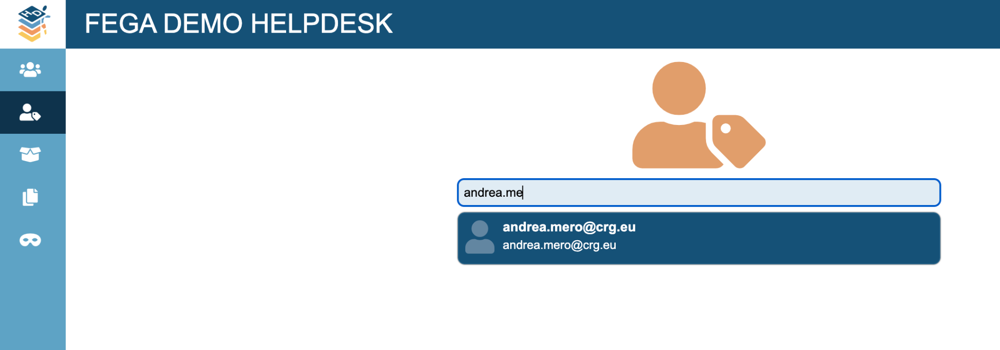
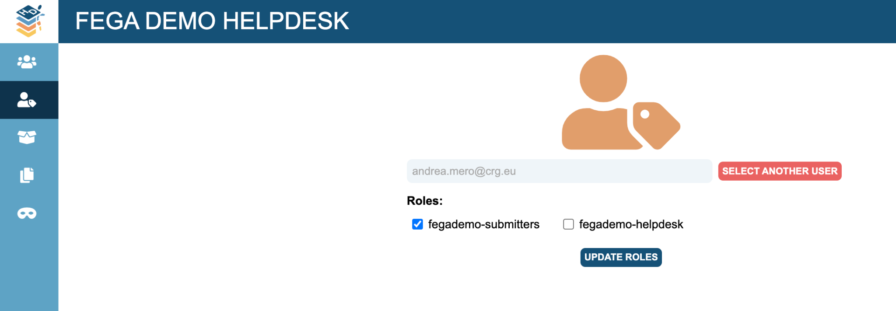

**SOP for Federated EGA Helpdesk - Grant submitter role to FEGA user
using the Helpdesk Portal**

| Document Owner | BioData.pt                                    |
|----------------|-----------------------------------------------|
| Authors        | Jorge Oliveira, Miguel Cisneiros, Jorge Silva |
| Version        | 1.0                                           |
| Document Code  | FEGA-PT-Grant-Submitter-Role-1                |
| Effective date | 07-04-2025                                    |
| Origin         | Adapted from Central EGA SOP V1.0             |

**Purpose**

Once you have set up your FEGA Helpdesk Portal, you can manage who
becomes a submitter to deposit data to your FEGA Portugal submitter
portal. If you don’t know how to get access to your FEGA Helpdesk node
for the first time, please follow
[<u>this</u>](https://docs.google.com/document/d/1AzhK3B3NrwqJSB3hF6Ajw4_x_X2BaOnQ/edit?usp=drive_link&ouid=108280939628938870978&rtpof=true&sd=true)
SOP.

**Scope**

This SOP indicates the steps to follow to grant a submitter role to a
FEGA user on the FEGA Portugal Submitter Portal.

**Procedure**

1.  *The new member to be added to your FEGA Helpdesk Portal needs to
    register as an EGA user by populating the [<u>registration
    form</u>](https://ega-archive.org/register/).*

2.  *CEGA Helpdesk will have to verify your account. Once it has been
    verified by CEGA Helpdesk, proceed with step 3.*

3.  *A FEGA Helpdesk admin will login to their FEGA Helpdesk Portal
    (helpdesk.portugal.ega.archive.org) and go to ROLES*

4.  *Look for the member registered in step 1. Make sure you write the
    full username or email. The suggestion box is no longer
    implemented.*

5.  *Click on the role you want to grant to this user ({fega}
    submitters) and click on UPDATE ROLE*

6.  *Done!*

