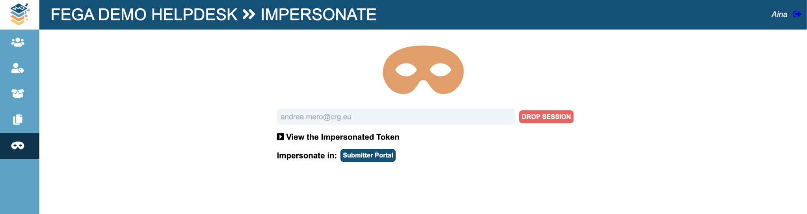

# FEGA SOP - SOP for Federated EGA Helpdesk - Impersonate a FEGA user (FEGA Portugal)

| Metadata | Value |
| -- | -- |
| Template ID | `FEGA-PT-SOP0015` |
| Template version | `v1.1` |
| Topic | SOP for Federated EGA Helpdesk |
| SOP type | SOP |
| Node | FEGA-PT |
| Instance version | `v1.0` |

## Document History

| Template version | Instance version | Author(s) | Description of changes | Date |
| -- | -- | -- | -- | -- |
| `v1.1` | `v1.0` | Jorge Silva - BioData.pt and UAVR | Initial FEGA Portugal instance; updated URLs and node references | 14-10-2025 |

## Purpose

Once you have set up your FEGA Portugal Helpdesk Portal, you can impersonate a
user and login as that user without sharing credentials. This is most
useful when a user reports an issue with their submission or with
managing their data requests, and you can check their portal without
sharing passwords. If you don’t know how to get access to your FEGA
Helpdesk node for the first time, please follow
[<u>this</u>](../templates/FEGA-SOP0014_SOP_for_Federated_EGA_Helpdesk_-_How_to_obtain_Helpdesk_role_for_the_first_time.md)
SOP.

## Scope

Once you have set up your FEGA Helpdesk Portal, you can impersonate a
user and login as that user without sharing credentials.

## Procedure

1. *Log in to the FEGA Portugal Helpdesk Portal
    (helpdesk.portugal.ega.archive.org) with your credentials (you must
    be in the helpdesk group). Check
    [<u>this</u>](../templates/FEGA-SOP0014_SOP_for_Federated_EGA_Helpdesk_-_How_to_obtain_Helpdesk_role_for_the_first_time.md)
    SOP if you want to gain access for the first time. Or
    [<u>this</u>](../templates/FEGA-SOP0012_SOP_for_Federated_EGA_Helpdesk_-_Add_new_Helpdesk_officers_to_your_Helpdesk_Portal.md)
    SOP if you already have an admin and would like to add more people.*

2. *Once you are logged in go to IMPERSONATE*

3. *Type the full length of the username or email of the FEGA user you
    want to check and select it from the drop-down menu*

4. *You will immediately obtain a token to impersonate the FEGA user.*

6. *You can also check the token by clicking on “View the impersonated
    Token”*

7. *Once you are impersonating the user, you will see the different
    roles that user is assigned to, and find a direct link to the portal
    they are using. In this case, this user is a submitter and can only
    impersonate the user in the Submitter Portal.*

8. *Click DROP SESSION whenever you want to stop impersonating the
    user.*

