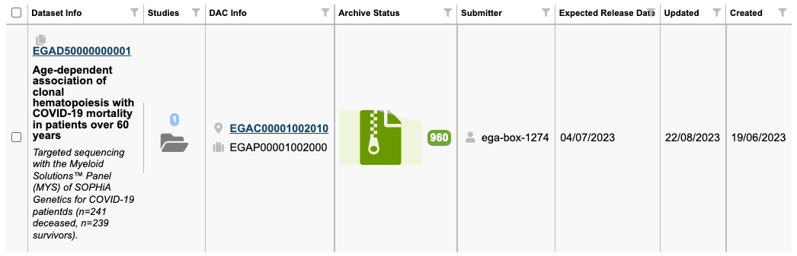

# FEGA SOP - EXAMPLE SOP for Handling Dataset Release

| Metadata | Value |
| -- | -- |
| Template ID | `FEGA-SOP0005` |
| Template version | `—` |
| Topic | User-facing Processes |
| SOP type | SOP |
| Node | — |
| Instance version | `—` |

## Document Overview

| Field | Value |
| -- | -- |
| Document Owner | Aina Jené - CEGA Operations Manager (CRG) |
| Contributors | Name(s) - Role(s)/Title(s) |
| Version | 1.0 |
| Effective date | DD-MM-YYYY |
| Approvals | Name(s) |
| Next revision due | DD-MM-YYYY |

## Document History

| Template version | Instance version | Author(s) | Description of changes | Date |
| -- | -- | -- | -- | -- |
| `—` | `—` | Name(s) - Role(s)/Title(s) | Initial release | DD-MM-YYYY |

## Purpose

With the launch of the new services, users must now specify an expected
release date for their datasets. However, it's important to note that
this release date may not always remain accurate or may have changed
since its initial setting.

To ensure the utmost precision and alignment with users’ intentions, we
continue to rely on user confirmation before proceeding with any dataset
release. This confirmation step acts as a final checkpoint, ensuring
that the release aligns perfectly with your current requirements. Your
input in this regard greatly assists us in providing a seamless and
tailored service.

## Scope

This document aims to provide the EGA Helpdesk team with a comprehensive
understanding of when to release datasets using the Helpdesk Portal.

## Procedure

[<u>Diagram for
Helpdesk</u>](https://drive.google.com/file/d/1OYnr_b3QX-0_rKjbQm2WbAN4u5qg8o0T/view?usp=sharing)
(AFTER SUBMISSION)

### Datasets pending to be released with RT ticket

If you have taken an RT ticket requesting to release a dataset, please,
follow these steps:

1.  Check the dataset ID.

    1.  If the ID(s) is assigned at EBI (EGAD000…) then follow
        [<u>this</u>](https://docs.google.com/document/d/14BQMKyurAc72koA4UHzJmJ4WP2HL3Y8wdTPjtcICbfM/edit?usp=sharing)
        SOP for sequencing datasets, or
        [<u>this</u>](https://docs.google.com/document/d/1i0oXBRseLXL2IgHh_5NzwFLLGguvbEcQCMh7zuZ6rZk/edit?usp=sharing)
        other SOP for array datasets.

    2.  If the ID(s) is assigned at CRG (EGAD500…) then continue with
        step 2

2.  Log in to the [<u>Helpdesk
    Portal</u>](http://helpdesk.ega-archive.org) and go to “DATASET
    RELEASE”

3.  Look for the dataset ID(s) provided in the RT ticket. You can filter
    the results in the table using control+F / command+F.

4.  Once you find the dataset(s), check the following information:

    1.  Title + description is correct (same criteria as this
        [<u>SOP</u>](https://docs.google.com/document/d/1xXJGkQ36XRmR5qAI0hzljx4tS1PKri-FwRF7ufF46Mg/edit#heading=h.cb4gumpcyhfg))

    2.  The request in RT comes from the submitter in the Helpdesk
        Portal (*column name: Submitter*)

    3.  All files are archived (in green)

        1.  In case that there is one or more files pending to be
            archived (in grey) set a reminder and check the status of
            the files in 24 hours.

        2.  If after 24 hours the file is still pending, create a CRG
            JIRA ticket and inform the CRG dev team.

    4.  The submitter is the same as the open RT ticket. If not, we need
        a written confirmation from the submitter through the RT ticket.

5.  Once all the information is correct, select them by clicking on the
    checkbox on the first column.

6.  Click the release button at the bottom of the table

7.  Check if the study release worked by going to the EGA website

    1.  [<u>https://ega-archive.org/datasets/{datasetID</u>](https://ega-archive.org/datasets/%7BdatasetID)}
        

    2.  If the dataset is available on the website proceed to reply to
        the RT ticket using RT Article
        [<u>871</u>](https://helpdesk.ebi.ac.uk/Articles/Article/Display.html?id=871).

    3.  If the dataset is not available on the website, create a CRG
        JIRA ticket to the dev team (Sabela) , so they can have a look
        at the issue. You can use the EC project for this issue.

8.  In the dataset webpage, check if the Access Policy section is
    completed. Otherwise inform the user that the policy is publicly
    available and ask to improve it.

### Datasets pending to be released with no RT ticket

For those users that set an expected release date but did not created an
RT ticket

1.  Log in to the [<u>Helpdesk
    Portal</u>](http://helpdesk.ega-archive.org) and go to “DATASET
    RELEASE”

2.  Pick the oldest “expected release date” (*column name: Expected
    Release Date*) and extract the info of the submitter (*column name:
    Submitter*)

3.  Check the following information of your selected dataset:

    1.  Title + description is correct (same criteria as this SOP)

    2.  The request in RT comes from the submitter in the Helpdesk
        Portal (*column name: Submitter*)

    3.  All files are archived (in green)

        1.  In case that there is one or more files pending to be
            archived (in grey) set a reminder and check the status of
            the files in 24 hours.

        2.  If after 24 hours the file is still pending, create a CRG
            JIRA ticket and inform the CRG dev team. You can use the EC
            project.

4.  Once all the information is correct, look if there is any active RT
    ticket related to this user and this topic (data deposition)

    1.  If the submitter is an email account, you can already look for
        this email in RT

    2.  If the submitter is a username you can search for the user
        information in the Helpdesk Portal \> Users \> Submitter

    3.  If the submitter is ega-box, you can check for the authorised
        submitter list in the vault (original documentation when
        requesting a submission account), ERAPRO (if info available), or
        in
        [<u>this</u>](https://docs.google.com/spreadsheets/d/188B7iiR_GQA0g55R_aHQOQkulBJnbG05/edit?usp=sharing&ouid=111259446040118372187&rtpof=true&sd=true)
        spreadsheet (for older accounts).

<table style="width:81%;">
<colgroup>
<col style="width: 81%" />
</colgroup>
<thead>
<tr>
<th style="text-align: left;">Query in ERAPRO &gt; ERA</th>
</tr>
<tr>
<th style="text-align: left;">
SELECT EGA_SUBMISSION_ACCOUNT.DIR_NAME,
EGA_SUBMISSION_CONTACT.*

FROM EGA_SUBMISSION_ACCOUNT

JOIN EGA_SUBMISSION_CONTACT ON
EGA_SUBMISSION_ACCOUNT.SUBMISSION_ACCOUNT_ID =
EGA_SUBMISSION_CONTACT.SUBMISSION_ACCOUNT_ID

WHERE EGA_SUBMISSION_ACCOUNT.DIR_NAME = 'ega-box-1978';
</th>
</tr>
</thead>
<tbody>
</tbody>
</table>

5.  If there’s an active RT ticket, check with the ticket owner (another
    Helpdesk officer). The assigned owner of the ticket should then
    follow the instructions under “[<u>Datasets pending to be released
    with no RT
    ticket</u>](#datasets-pending-to-be-released-with-rt-ticket)”

6.  If there’s not an active RT ticket, then create a new ticket in RT
    using article XXXX ([<u>text - part
    1</u>](https://docs.google.com/document/d/1amo_iaLjNw-9sxMS_ByATRe6ZYR3j-s4hns8W1Tw6hI/edit?usp=sharing)).

    1.  If the submitter confirms the release:

        1.  Log in to the [<u>Helpdesk
            Portal</u>](http://helpdesk.ega-archive.org) and go to
            “DATASET RELEASE”

        2.  Find the dataset(s), select them by clicking on the checkbox
            on the first column.

        3.  Click the release button at the bottom of the table

        4.  Check if the study release worked by going to the EGA
            website

            1.  [<u>https://ega-archive.org/datasets/{datasetID</u>](https://ega-archive.org/datasets/%7BdatasetID)}

            2.  If the dataset is available on the website proceed to
                reply to the RT ticket using RT Article 871.

            3.  If the dataset is not available on the website, contact
                the CRG dev team through slack, so they can have a look
                at the issue.

    2.  If the submitter asks for an extension, set a reminder for the
        new date in the RT ticket and ask the CRG dev team to update the
        expected release date on the HD Portal

    3.  If the user does not confirm the release:

        1.  Follow up with the submitter every week using article XXXX
            ([<u>text - part
            2</u>](https://docs.google.com/document/d/1amo_iaLjNw-9sxMS_ByATRe6ZYR3j-s4hns8W1Tw6hI/edit?usp=sharing)).

        2.  If the submitter eventually confirms follow instructions
            6(a)

        3.  If the submitter eventually asks for an extension follow
            instructions 6(b)

        4.  If the submitter never replies after 4 consecutive weeks,
            revoke the dataset (currently revoking is not an option.
            Just inform the HD team, that the dataset release is stalled
            and resolve the RT ticket).
