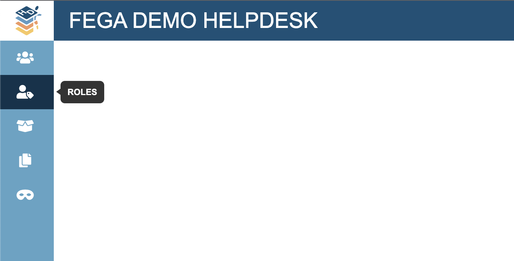
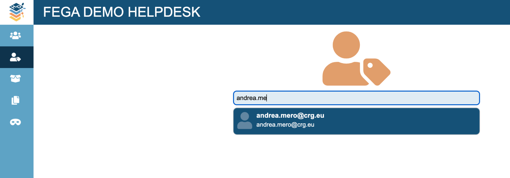
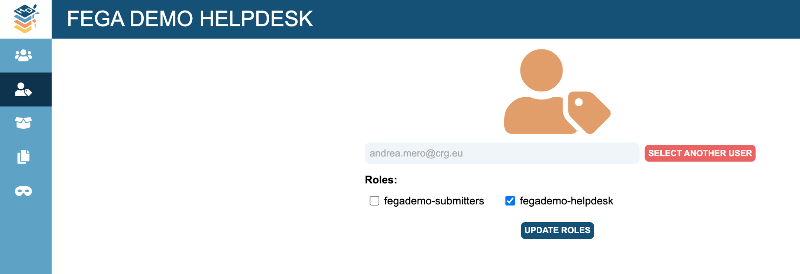

# FEGA SOP - SOP for Federated EGA Helpdesk - Add new Helpdesk officers to your Helpdesk Portal

| Metadata | Value |
| -- | -- |
| Template ID | `FEGA-SOP0012` |
| Template version | `v1.1` |
| Topic | SOP for Federated EGA Helpdesk |
| SOP type | SOP |
| Node | CEGA |
| Instance version | `—` |

## Document History

| Template version | Instance version | Author(s) | Description of changes | Date |
| -- | -- | -- | -- | -- |
| `v1.0` | `—` | Aina Jené - EGA-CRG Operations Manager | Initial release | 31-05-2023 |
| `v1.1` | `—` | Jorge Oliveira - FEGA PT Operations | fixed links | 14-10-2025 |

## Purpose

Once you have set up your FEGA Helpdesk Portal, you can manage who
accesses your Helpdesk portal from now on. If you don’t know how to get
access to your FEGA Helpdesk node for the first time, please follow
[<u>this</u>](./FEGA-SOP0014_SOP_for_Federated_EGA_Helpdesk_-_How_to_obtain_Helpdesk_role_for_the_first_time.md)
SOP.

## Scope

This SOP indicates the steps to follow in order to add new Helpdesk
officers as admin for your FEGA Helpdesk Portal.

## Procedure

1.  *The new member to be added to your FEGA Helpdesk Portal needs to
    register as an EGA user by populating the [<u>registration
    form</u>](https://ega-archive.org/register/).*

2.  *CEGA Helpdesk will have to verify your account. Once it has been
    verified by CEGA Helpdesk you can proceed with step 3.*

3.  *A FEGA Helpdesk admin will login to their FEGA Helpdesk Portal
    (helpdesk.{fega}.ega-archive.org) and go to ROLES*

4.  *Look for the member registered in step 1.*

5.  *Click on the role you want to grant to this user ({fega} helpdesk)
    and click on UPDATE ROLES.*

