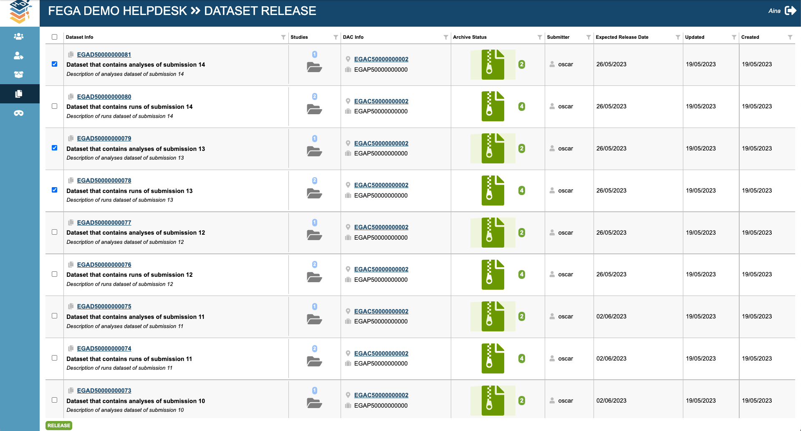
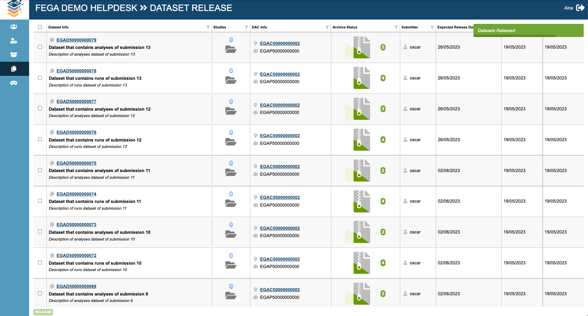

# FEGA SOP - SOP for Federated EGA Helpdesk - Release a FEGA dataset

| Metadata | Value |
| -- | -- |
| Template ID | `FEGA-SOP0016` |
| Template version | `v1.1` |
| Topic | SOP for Federated EGA Helpdesk |
| SOP type | SOP |
| Node | CEGA |
| Instance version | `—` |

## Document History

| Template version | Instance version | Author(s) | Description of changes | Date |
| -- | -- | -- | -- | -- |
| `v1.0` | `—` | Aina Jené - EGA-CRG Operations Manager | Initial release | 31-05-2023 |
| `v1.1` | `—` | Jorge Oliveira FEGA-PT Operations | Update to Github and metadata | 14-10-2025 |

## Purpose

*The purpose of this SOP is to establish a standardised process for
releasing a Federated EGA (FEGA) dataset within the FEGA Helpdesk. The
SOP outlines the necessary steps and guidelines to ensure the secure and
compliant release of datasets, while maintaining data integrity and
protecting the privacy and confidentiality of individuals involved.*

*By implementing this SOP, several valuable outcomes can be achieved.
Firstly, it ensures consistent and controlled release of FEGA datasets,
promoting data discoverability and FAIRness.*

## Scope

This SOP indicates the steps to follow in order to release a FEGA
dataset once the user has set up a release date to make the dataset
discoverable on the CEGA (Central EGA) website.

## Procedure

1.  *A FEGA Helpdesk admin will login to their FEGA Helpdesk Portal
    (helpdesk.{fega}.ega.archive.org) and*

    1.  *Click on “Pending Datasets”*

2.  *go to DATASET RELEASE*

3.  *Check the summarised information in this tab*

4.  *Dataset info*

5.  *Study linked*

6.  *DAC and policy linked*

7.  *Number of archived files: it will always show the total number of
    archived files. Only once the FEGA node has archived the files the
    submitter will be able to finalise the submission. Hence, the files
    in this tab should always be archived.*

8.  *Submitter*

9.  *Expected Release Date*

10.  *Date of last dataset update*

11.  *Date of the dataset creation*

<!-- -->

12.  *Select the datasets you want to release:*

    1.  *One by one, by selecting the checkbox available next to the
        dataset info*

13.  *All at once, by selecting the checkbox on the top. Once you select
    the top checkbox, it will automatically select all datasets.*

14.  *When you have selected the datasets you want to release click the
    RELEASE button. It will show a message informing that the datasets
    have been released successfully*

