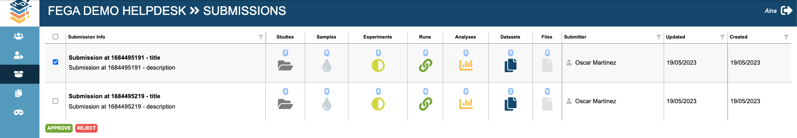
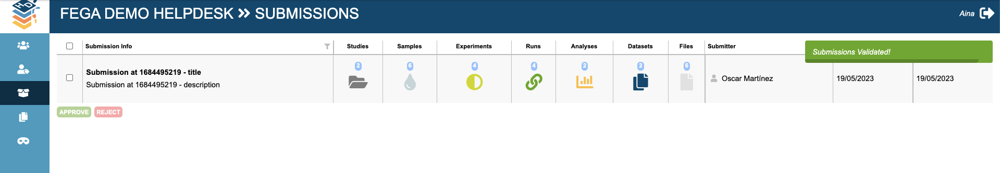

# FEGA SOP - SOP for Federated EGA Helpdesk - Validate a submission

| Metadata | Value |
| -- | -- |
| Template ID | `FEGA-SOP0017` |
| Template version | `v1.1` |
| Topic | SOP for Federated EGA Helpdesk |
| SOP type | SOP |
| Node | CEGA |
| Instance version | `—` |

## Document History

| Template version | Instance version | Author(s) | Description of changes | Date |
| -- | -- | -- | -- | -- |
| `v1.0` | `—` | Aina Jené - EGA-CRG Operations Manager | Initial release | 31-05-2023 |
| `v1.1` | `—` | Miguel Cisneiros - FEGA-PT Data Steward | Update to Github and metadata | 14-10-2025 |

**Purpose**

The purpose of this SOP is to establish a standardised process for
validating a submission within the Federated EGA Helpdesk. The SOP
outlines the necessary steps and guidelines to ensure that all submitted
data and accompanying documentation are thoroughly reviewed, verified,
and validated in a consistent and efficient manner.

By implementing this SOP, several valuable outcomes can be achieved.
Firstly, it promotes quality assurance by ensuring that all submissions
undergo a rigorous validation process. This helps to maintain the
integrity, accuracy, and reliability of the data and associated
information within the Federated EGA Helpdesk system. Secondly, the SOP
fosters transparency and accountability by providing a clear set of
guidelines that all team members can follow uniformly, thus reducing
potential errors, inconsistencies, and delays.

**Scope**

This SOP indicates the steps to follow in order to validate a FEGA
submission once the user has finalised it through the FEGA Submitter
Portal.

**Procedure**

1.  *A FEGA Helpdesk admin will login to their FEGA Helpdesk Portal
    (helpdesk.{fega}.ega.archive.org) and*

  - *Click on “Pending Submissions” or*

  
  - *go to SUBMISSIONS*

2. *Check the summarised information in this tab*

*You must check that the following information is correct:*

   - *Number of studies + relevant information*
   - *Number of samples + relevant information*
   - *Number of experiments + relevant information*
   - *Number of runs + relevant information*
   - *Number of analyses + relevant information*
   - *Number of datasets + relevant information*
   - *Number of files + relevant information*
   - *Submitter*

<!-- -->

3. *Once you have validated the relevant information from the
    submission(s). You can click the submission(s) and proceed to:*

  - *Accept by clicking the APPROVE green button*

> *Once the submission is approved you will receive a message informing
> that the submission is now validated and it will disappear from the
> list of pending submissions.*

  - *Decline by clicking the REJECT red button*

> *When you click to reject the submission it will show a window where
> you must write a comment with the reason for rejecting the submission
> and click SEND. Then, the submitters will be able to check the message
> on the Submitter Portal.*
>
> *After clicking send you will receive a message informing that the
> submission is now rejected and it will disappear from the list of
> pending submissions.*

