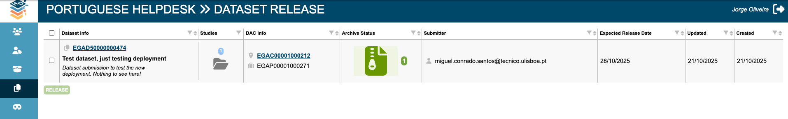

# FEGA SOP - SOP for Federated EGA Metadata Check and Release Protocol - v2.0

| Metadata | Value |
| -- | -- |
| Template ID | `FEGA-SOP0018` |
| Template version | `—` |
| Topic | Joint CEGA/FEGA Node Processes |
| SOP type | SOP |
| Node | `-` |
| Instance version | `—` |

## Document History

| Template version | Instance version | Author(s) | Description of changes | Date |
| -- | -- | -- | -- | -- |
| `—` | `—` | — | Initial release | — |
| 2.0 | `—` | — | CEGA updated version | 02-2024 |
| 2.1 | `—` | Jorge Oliveira, Jorge Silva, Miguel Cisneiros | FAIR-FEGA template | 30-10-2025 |
| 2.2 | `—` | Jorge Oliveira, Jorge Silva, Miguel Cisneiros | update template | 21-11-2025 |

# Purpose

To ensure that all public metadata submitted to Central EGA (CEGA) for a
Federated EGA (FEGA) study is correct and does not contain any
personally identifiable or sensitive information.This information is
displayed on the EGA website and is searchable by users to enable data
discovery. The FEGA Helpdesk must conduct a metadata review prior to
releasing the study by using the FEGA Helpdesk Portal. After this review
has been successfully completed, the FEGA Helpdesk can release the study
with previous approval from the authorised submitter.

# Scope

This SOP describes how FEGA Helpdesk shall complete a
metadata review for sequencing datasets submitted to CEGA by the FEGA
Submitter Portal (https://submission.{fega-node}.ega-archive.org
) as part of an FEGA study and is required before the
study is released.

# Procedure

**FEGA NODE:**

> Note: After  [<u>SOP0017</u>](../templates/FEGA-SOP0017_SOP_for_Federated_EGA_Helpdesk_-_Validate_a_submission.md) of validation is finalized and the authorized submitter has instructed the release of the dataset, the helpdesk should execute the following steps.

Steps to complete by the FEGA node **before**
checking the metadata and releasing the study

1.  Obtain the name of the submission from the
    submitter for the study that they want to release.

2.  Verify that the data files have been archived
    correctly.

3.  Follow this SOP to check the metadata through the
    FEGA Helpdesk Portal and generate the EGA accession IDs ( SOP:
    [<u>Validate a
    submission</u>](../templates/FEGA-SOP0017_SOP_for_Federated_EGA_Helpdesk_-_Validate_a_submission.md))  
    
    

1. Pre-release check of Study, DAC, and Dataset
descriptions

*Note: Each FEGA node must have their own list of
items to check. For example, the FEGA node might want to check that
sample metadata does not contain any personally identifiable
information. Checklists might differ between different FEGA nodes. **The
FEGA node’s checklist is the one that must be reviewed in this
step.***

**Metadata checks include**:

- **Study title** should be no more than 30 words and
  make sense to the user.

- **Study description** should be 3-5 sentences and
  should provide further details about the study (why, how,
  what).

- **Dataset title** should be no more than 30 words
  and should make sense to the user.

- **Dataset description** should be 2-4 sentences and
  should provide further unique details about the specific dataset (why,
  how, what).

- **Sample** **report** with public information in
  the metadata API and a sample count (equal to the number of
  rows).

  - For example, view public sample attributes given
    a Study Accession using the following (replace EGAS number with the
    study of interest):
    [<u>https://ega-archive.org/metadata/v2/samples?queryBy=study&queryId=EGAS00001002472</u>](https://ega-archive.org/metadata/v2/samples?queryBy=study&queryId=EGAS00001002472)

- **File** **report** with: number of files, file
  name, file type and check if there’s any phenotypic file.

*Note: Before accepting the submission to generate
the EGA accession IDs, the FEGA Helpdesk has to either approve the DAC
registration, or verify the following information of an already
registered DAC:*

- **Email address of DAC** must be valid and
  institutional.

**DAC main contact** must be specified for the DAC.
This can be checked by using the EGA metadata API, e.g.:
<https://ega-archive.org/metadata/v2/dacs/EGAC00001000205>

2\. After the check has been completed and everything is correct, the
FEGA node approves the submission to generate the EGA accession IDs for
the submission

3\. Notify the user (If necessary) that the check was completed
successfully and the Study and Dataset IDs were generated and the study
can be now released. Check with the user for a release date.

**Release Study**

1.  Follow the following SOP to Release the requested
    study and dataset.

2.  Notify the DAC/authorised submitter that their
    study has been released and is available to view on the EGA
    website.
